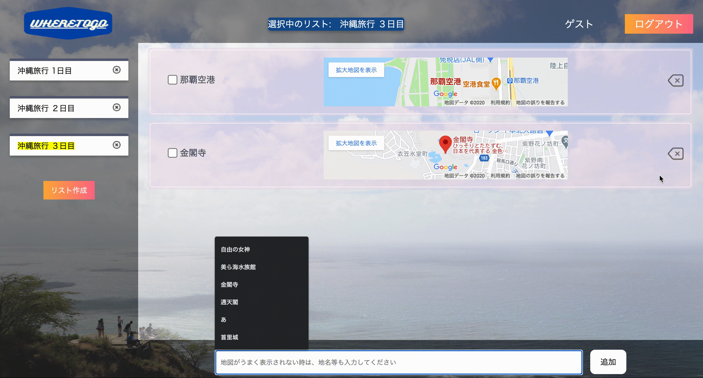

# アプリ名

WHERE TO GO

# 概要

旅行先での観光を快適化するためのTo Doリストです。
目的地(タスク)を追加すると、自動的にGoogle mapの地図が表示され、地図をクリックするとgoogle mapに飛ぶことができます。
リストは何個でも作成することが可能です。

# 本番環境

https://where-to-go-29746.herokuapp.com/

ゲストログインからお入りください。

# 制作背景(意図)

多くの方々が旅行に行く前に行きたい観光地をリストアップし、そのリストを見ながら観光します。しかし、目的地に行く際、リストで行先を確認し、地図アプリをわざわざ起動して、検索する必要があり、手間が発生してしまいます。

この地図アプリを起動して検索するという手間を省くために、リスト上に行きたい観光地名と一緒に地図情報を表示させ、そこから直接地図アプリに飛べると手間を省くことができると考えました。

# DEMO

## トップページ
マイページでリストを管理するため、初めて使うユーザーには新規登録してもらいます。

## 新規登録・ログインページ
ニックネーム、メールアドレス、パスワードで新規登録をします。

メールアドレスとパスワードでログインします。

## マイページ
リストとタスクの管理、表示をします。

## リスト作成画面
リストを作成します

## 削除機能
不要、または間違えて作成してしまったリスト、タスクを削除できます。

# 工夫したポイント
- 旅行したくなるようなviewにしました。
- 使用していてストレスがかからないように、感覚的に使えるシンプルな作りにしました。
- Google Maps Embed APIを使って、入力した目的地の地図情報を自動で表示できるようにしました。

# 使用技術(環境開発)

## バックエンド

Ruby, Ruby on Rails

## フロントエンド

HTML, CSS, Javascript

## データベース

MySQL

## API
Google Maps Embed API

## Webサーバー(本番環境)

heroku

## ソース管理

GitHub, GithubDesktop

## テスト
Rspec

## エディタ
VSCode

# 課題や今後したい実装
- 目的地（タスク）の追加、削除する際に非同期で行えるようにしたいです。
- 終了したタスクがわかるようにしたいです。(現状ではチェックボックスにチェックを付けても、ページがロードされるたびにチェックが外れてしまうため)

# テーブル設計

## users テーブル

| Column           | Type    | Options     |
| ---------------- | ------- | ----------- |
| nickname         | string  | null: false |
| email            | string  | null: false |
| password         | string  | null: false |

### Association

- has_many :lists
- has_many :tasks

## tasks テーブル

| Column         | Type       | Options                        |
| -------------- | ---------- | ------------------------------ |
| task           | string     | null: false                    |
| list           | references | null: false, foreign_key: true |

### Association
- belongs_to :user
- belongs_to :list

## lists テーブル

| Column         | Type    | Options     |
| -------------- | ------- | ----------- |
| name           | string  | null: false |

### Association
- belongs_to :user
- has_many :tasks